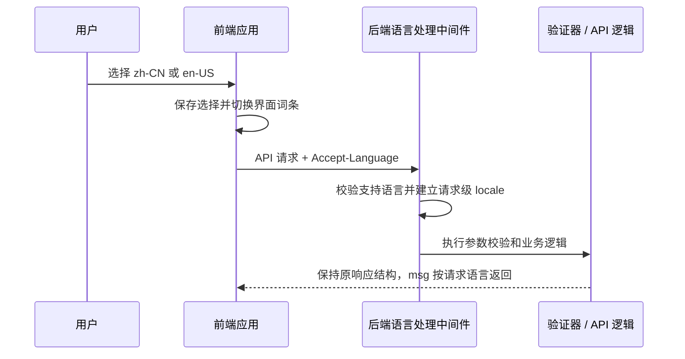

# 中英多语言支持设计

## 状态

- 阶段：设计审阅
- 首期语言：简体中文（`zh-CN`）、英语（`en-US`）
- 默认语言：`zh-CN`

## 目标与范围

为管理后台、PC 端和 UniApp 客户端提供一致的中英界面切换，并让后端校验提示和 API 错误提示按请求语言返回。语言缺失或不受支持时回退到简体中文。

首期包含：

- 三个前端应用中的静态界面文案、表单提示和应用内错误提示。
- Element Plus 组件文案随应用语言同步。
- 后端请求语言解析、字段校验信息、框架级验证文案和常用 API 错误提示。
- 语言选择和持久化；客户端请求向后端传递当前语言。

首期不包含：

- 商品、文章、站点配置等数据库业务内容的翻译与编辑。
- 新增数据库表或迁移现有业务数据。
- API 响应结构调整、URL 语言前缀、SEO 多语言页面。
- 第三种及后续语言的实际翻译；语言代码和资源结构需允许后续扩展。

## 当前情况

- `admin/src/App.vue` 和 `pc/app.vue` 固定导入 Element Plus 的简体中文包。
- `uniapp/package.json` 已有 `vue-i18n`，但源码没有实际调用或语言资源目录。
- `server/config/translation.php` 默认使用 `zh_CN` 并配置 `en` fallback。
- `server/resource/translations/en/validate.php` 的验证值仍是中文。
- 后端配置和前端组件目前没有统一的请求级语言切换链路。

## 设计决策

### 1. 对外统一语言代码

所有前端状态和 HTTP 请求使用 BCP 47 形式的 `zh-CN`、`en-US`。后端在内部映射到现有翻译目录：`zh-CN` 对应 `zh_CN`，`en-US` 对应 `en`。不要让内部目录名成为客户端 API 契约。

解析优先级：用户已保存的选择、浏览器或设备语言、默认 `zh-CN`。只接受当前支持列表中的语言；不支持或无效值回退为 `zh-CN`。后端按请求解析客户端发送的 `Accept-Language`，并将最终解析出的语言作为该请求的语言上下文。

### 2. 各端拥有本地翻译资源

admin、PC、UniApp 是独立构建应用，首期在各应用内部维护翻译字典，不新增跨应用共享包。三端采用一致的语言代码、词条命名约定和常见术语；应用自身词条随应用发布。

- admin：接入 `vue-i18n`，在现有全局导航或设置入口提供语言切换，选择写入浏览器存储。
- PC：接入 `vue-i18n`，在站点已有导航或设置入口提供语言切换，选择写入可供 SSR 读取的 Cookie；静态构建首次渲染以中文为默认值，水合后应用用户保存的语言。
- UniApp：接入已安装的 `vue-i18n`，在应用现有设置入口提供语言切换，选择写入 UniApp 本地存储。
- admin 与 PC 的 Element Plus locale 和应用 locale 同步切换。
- 日期、数字等界面格式化使用当前 locale；金额值和业务计算规则保持原样。

用户选择优先于系统语言。首期语言选择为应用级设置，不新增服务端用户偏好字段。

### 3. 后端按请求翻译校验和错误提示

客户端 API 请求统一发送当前语言。后端在请求进入控制器和校验逻辑前解析语言，并让验证器与响应消息使用该请求的翻译资源。

语言状态必须限制在单个请求内。Webman 是常驻进程，处理完一个请求后不得让语言状态影响后续请求。若底层翻译组件使用进程级可变状态，应在请求结束时可靠恢复；优先采用显式请求上下文或显式 locale 参数。

现有 API 响应字段与类型保持不变，按语言返回 `msg` 文本。现有业务错误码、成功码、`data` 结构、HTTP 状态码和权限行为不因语言切换而改变。前端本地表单校验由本地翻译字典处理；服务端参数校验和业务错误由后端返回对应语言的提示。

英文验证包需提供真实英文译文，包括带占位符的规则提示。常用业务错误消息整理成稳定翻译键，避免在多个控制器中复制不同译文。对无法立即翻译的缺失词条回退中文，并在开发检查中暴露缺失键。

### 4. 不改业务内容存储

首期数据库记录里的标题、描述等内容继续按当前存储和读取方式返回。多语言字典只承载产品静态界面文案和可翻译提示，不用于存储管理员编辑的业务文本。

## 数据流

## 错误处理与兼容

- 缺失、无效或不受支持的语言统一回退到 `zh-CN`。
- 单个翻译键缺失时按 `zh-CN` 回退，不返回空字符串或翻译键本身。
- API 响应 JSON 的结构、字段类型及业务错误码保持兼容。
- 若部署层缓存 API 响应，需避免不同 `Accept-Language` 请求共用错误语言的缓存内容。
- PC SSR 与静态输出不得因读取用户语言而产生服务端与客户端水合不一致；静态首屏使用中文，再于客户端初始化持久化选择。

## 验收标准

1. admin、PC、UniApp 均可在 `zh-CN` 和 `en-US` 间切换，刷新后保留用户选择。
2. 三端应用自有文案和 Element Plus 组件文案与当前选择一致。
3. 服务端对中英文无效参数返回相应语言的验证提示，响应字段结构保持不变。
4. 无效语言和缺失译文按 `zh-CN` 回退。
5. 在同一 Webman worker 上连续请求不同语言时，后续请求不继承前一请求的语言。
6. 首期不新增数据库迁移，不改变业务内容字段和业务计算。

## 验证计划

- 后端：为语言解析、支持列表、默认回退、请求隔离和中英文验证提示添加针对性测试。
- admin、PC、UniApp：运行各自已有的类型检查或构建命令，并验证词条加载、语言切换、持久化和组件库 locale。
- API 兼容：对比切换语言前后的响应结构、字段类型及业务码；只允许 `msg` 文本随 locale 变化。
- 运行时验收：使用连续中英文请求检查常驻 worker 的请求隔离；本地静态检查不能替代实际 HTTP 验收。

## 主要风险

- 多个前端和后端存在硬编码中文，完整覆盖需要先盘点可见文案并逐模块迁移。
- PC 端同时有静态构建和 SSR 构建，语言初始化必须分别覆盖，避免水合问题。
- 后端验证包中的占位符格式必须保持一致，否则参数化提示可能损坏。
- API 入口、客户端请求封装及统一响应实现需要在实施计划阶段再次沿当前源码核对，避免遗漏某类请求或错误出口。
